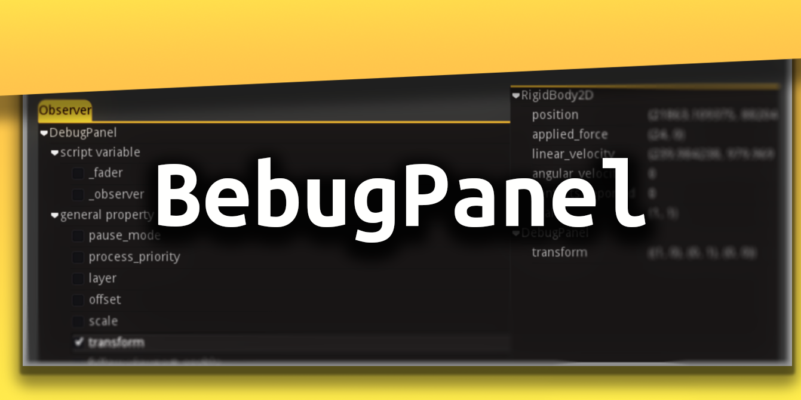

# BebugPanel

A collection of debug tools by yours truly - **Bramwell Williams**. Currently the observer panel which acts as an in game inspector for the properties of nodes.

The BebugPanel is a canvas layer you can add to your game world with a selection of tools to aid in your debugging process.

The core of the panel is the observer window. Here you can add groups you want to observe in real time. Their properties are exposed and you can observer them changing in real time.

## How to

### Usage

1. Add the BebugPanel to your game scene
1. Set the InputMap action that should open and close the window with the `Debug Action` property.
1. Add group names to the `Observation Group` property to define the nodes you want the observer to track the variables of.

### Styling

Within the common directory you can find the default theme used by the debug panel. This theme is inherited in the `MarginContainer` of the debug panel as well as the `DataHud`.
